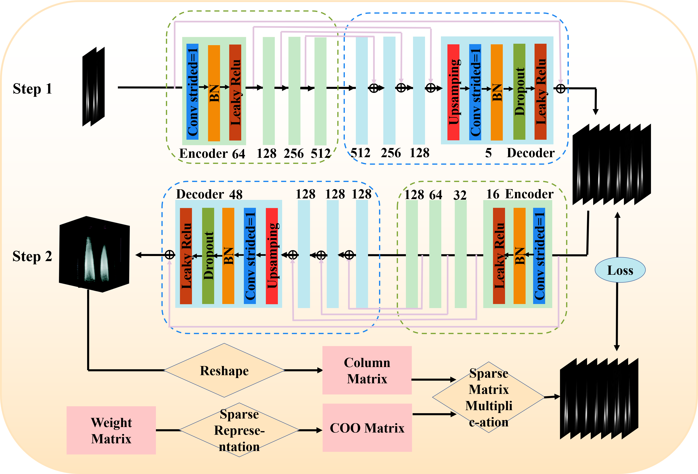

# Physically Enhanced Neural Network Based on Projection Map Synthesis for Chemiluminescence Tomography Reconstruction with Limited Views
# Introduction
This is torch demo implementation of paper (Physically Enhanced Neural Network Based on Projection Map Synthesis for Chemiluminescence Tomography Reconstruction with Limited Views). You may get more information in the original paper:

# Paper

Sunyong Zhu, Ying Jin, Xiangyu Zhang, Quanying Wu and Guohai Situ, "Physically Enhanced Neural Network Based on Projection Map Synthesis for Chemiluminescence Tomography Reconstruction with Limited Views," Opt. Express

Paper Link: https://doi.org/10.1364/OE.545447
 
# Environment Configuration

  os
  
  numpy
  
  tensorflow

  PIL
  
  scipy
  
  h5py
 
 
# Description of the catalogue structure
    ├── ReadMe.md           // Help File
     
    │   ├── interpolation network-step1     // step1
    
    │      
    │       ├── train1.py
    
            ├── model.py
    
    │   └── PIPEN-step2            // step2
    
            ├── PIPEN.py
    
 
# Framework
This study introduces a two-step neural network (PIPEN) designed for volumetric tomography. A priori data from projection interpolation network in the first step is integrated with physical constraints from the forward imaging model of volumetric tomography used in the second step. The PIPEN demonstrates high scalability in addressing both data distribution shifts and limited-view scenarios.
 
 

# Result
 
 
 

 
 
